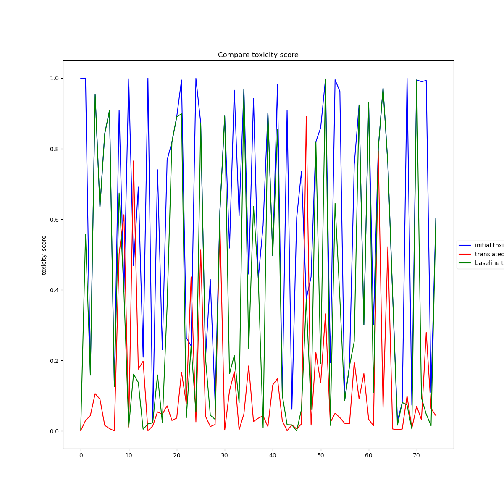
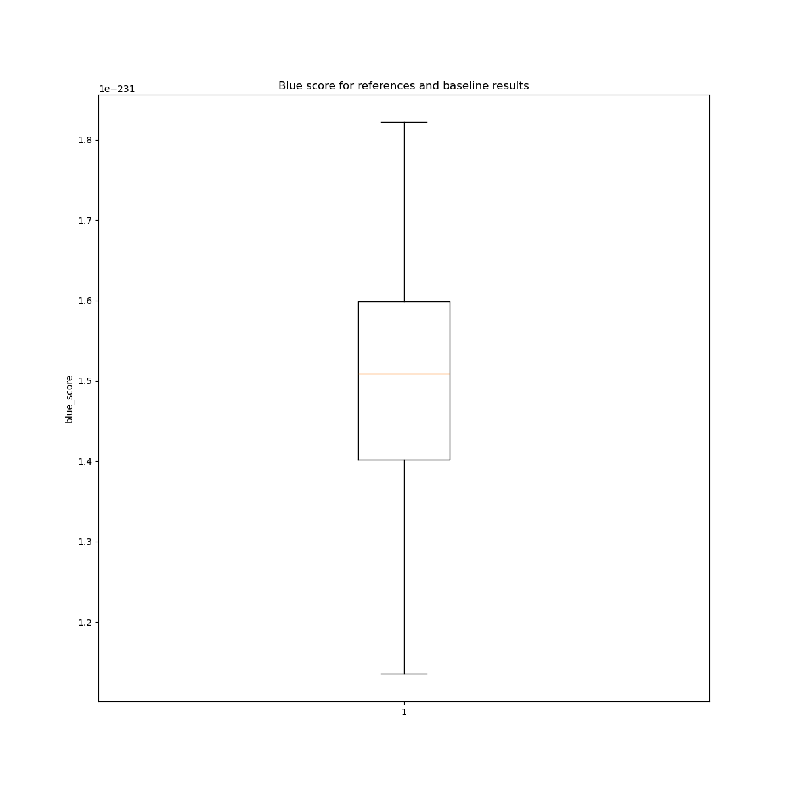
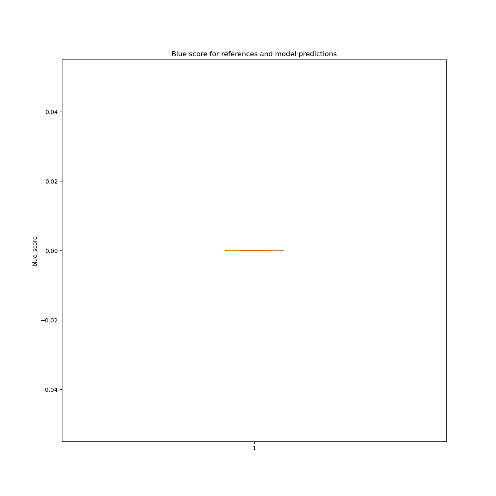

# Text detoxification
## Report about results and evaluations

Translation sentecnes are produced by two models:
- Baseline. Just remove toxic words
- GeDi. Pretrined model from [1].

For the evaluation I used two metrics:
- Toxicity score from my logreg classifier
- Similarity from blue score

Evaluation results may be seen in **reports/figures**.

Let us examine them:

Plot of toxicity score

One can see that the plot is relatively noisy. However, score of translated sentences are closer to zero than scores for references and base_line.

Plot of blue score for refence and base_line

Plot of blue score for reference and translated

One can see that baseline gives better score, but the metric seems to be not the best for estimation of similarity. So thurther investigations are needed.

To conclude, deep learning seems not to be the best solution for this problem at list at this moment. Toxicity flags that were mensioned in "2.0-text-corpus-exploration.ipynb" seem to be good instrument to create some heuristics. And application of heuristics seems to be far computationaly cheaper by this moment and have a potential for good detoxification.

## References
[1] https://github.com/s-nlp/detox/tree/main